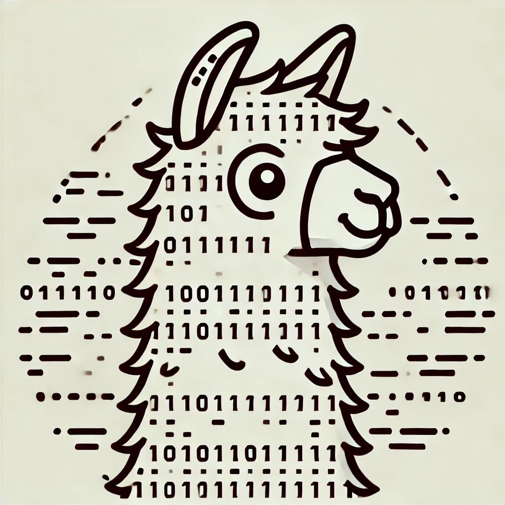

# Awesome-LLM-Watermark
<!--  -->

An UP-TO-DATE collection list for Large Language Model (LLM) Watermark

<!--  -->

<!-- vscode-markdown-toc -->
* 1. [LLM watermark](#LLMwatermark)
	* 1.1. [Token-level watermark](#Token-levelwatermark)
	* 1.2. [Sentence-level watermark (sentence embedding-based watermark)](#Sentence-levelwatermarksentenceembedding-basedwatermark)
	* 1.3. [Model-level watermark](#Model-levelwatermark)
	* 1.4. [Watermarking detection](#Watermarkingdetection)
* 2. [Attack for watermark](#Attackforwatermark)
	* 2.1. [Watermark stealing attack](#Watermarkstealing)
	* 2.2. [Watermark removal attack](#Watermarkremoval)
	* 2.3. [Watermark spoofing attack](#Watermarkspoofing)
	* 2.4. [Robust watermark](#Robustwatermark)
* 3. [Multi-bit watermark](#Multi-bitwatermark)
* 4. [Unbiased watermark](#Unbiasedwatermark)
* 5. [Analysis of LLM watermark](#AnalysisofLLMwatermark)
* 6. [Survey](#Survey)

<!-- vscode-markdown-toc-config
	numbering=true
	autoSave=true
	/vscode-markdown-toc-config -->
<!-- /vscode-markdown-toc -->

##  1. LLM watermark
###  1.1. Token-level watermark
* A Watermark for Large Language Models 
  * ICML 2023
  * <http://arxiv.org/abs/2301.10226>
* Publicly Detectable Watermarking for Language Models [paper](http://arxiv.org/abs/2310.18491)
* An Unforgeable Publicly Verifiable Watermark for Large Language Models
  * ICLR 2024
  * https://openreview.net/forum?id=gMLQwKDY3N
* On the Reliability of Watermarks for Large Language Models
  * ICLR 2024
  * https://openreview.net/forum?id=DEJIDCmWOz
* Improving the Generation Quality of Watermarked Large Language Models via Word Importance Scoring [paper](http://arxiv.org/abs/2311.09668)
* WatME: Towards Lossless Watermarking Through Lexical Redundancy
  * ACL 2024
  * https://aclanthology.org/2024.acl-long.496/
  * **Alias** X-Mark: Towards Lossless Watermarking Through Lexical Redundancy [paper](http://arxiv.org/abs/2311.09832)
* Towards Optimal Statistical Watermarking [paper](http://arxiv.org/abs/2312.07930)
* Who Wrote this Code? Watermarking for Code Generation 
  * ACL 2024
  * https://aclanthology.org/2024.acl-long.268
* Natural language watermarking via paraphraser-based lexical substitution 
  * Artificial Intelligence
  * https://linkinghub.elsevier.com/retrieve/pii/S000437022300005X
* Adaptive Text Watermark for Large Language Models
  * ICML 2024
  * [paper](https://proceedings.mlr.press/v235/liu24e.html#:~:text=This%20paper%20proposes%20an%20adaptive%20text%20watermarking%20strategy,model%20and%20keep%20the%20low-entropy%20token%20distributions%20untouched.)
* Duwak: Dual Watermarks in Large Language Models
  * ACL findings 2024
  * https://aclanthology.org/2024.findings-acl.678
* Permute-and-Flip: An optimally stable and watermarkable decoder for LLMs 
  * NeurIPS workshop 2024
  * https://arxiv.org/pdf/2402.05864

###  1.2. Sentence-level watermark (sentence embedding-based watermark)
* WaterPool: A Watermark Mitigating Trade-offs among Imperceptibility, Efficacy and Robustness
  * http://arxiv.org/abs/2405.13517
* SemStamp: A Semantic Watermark with Paraphrastic Robustness for Text Generation
  * NAACL 2024
  * http://arxiv.org/abs/2310.03991
* k-SemStamp: A Clustering-Based Semantic Watermark for Detection of Machine-Generated Text
  * ACL Findings 2024
  * http://arxiv.org/abs/2402.11399
* A Semantic Invariant Robust Watermark for Large Language Models
  * ICLR 2024
  * http://arxiv.org/abs/2310.06356
* A Robust Semantics-based Watermark for Large Language Model against Paraphrasing
  * NAACL Findings 2024
  * https://aclanthology.org/2024.findings-naacl.40
* Context-aware Watermark with Semantic Balanced Green-red Lists for Large Language Models
  * EMNLP 2024
  * https://aclanthology.org/2024.emnlp-main.1260
* Token-Specific Watermarking with Enhanced Detectability and Semantic Coherence for Large Language Models
  * ICML 2024
  * http://arxiv.org/abs/2402.18059
* SEFD: Semantic-Enhanced Framework for Detecting LLM-Generated Text [paper](http://arxiv.org/abs/2411.12764)
* DeepTextMark: Deep Learning based Text Watermarking for Detection of Large Language Model Generated Text [paper](http://arxiv.org/abs/2305.05773)
* Adversarial Watermarking Transformer: Towards Tracing Text Provenance with Data Hiding
  * IEEE S&P 2021
  * https://ieeexplore.ieee.org/document/9519400/
* PersonaMark: Personalized LLM watermarking for model protection and user attribution [paper](http://arxiv.org/abs/2409.09739)
* REMARK-LLM: A Robust and Efficient Watermarking Framework for Generative Large Language Models
  * USENIX Security 2024

###  1.3. Model-level watermark
* Provable Robust Watermarking for AI-Generated Text
  * ICLR 2024
  * http://arxiv.org/abs/2306.17439
* Watermarking LLMs with Weight Quantization [paper](http://arxiv.org/abs/2310.11237)
* EmMark: Robust Watermarks for IP Protection of Embedded Quantized Large Language Models [paper](http://arxiv.org/abs/2402.17938)
* Watermarking Counterfactual Explanations [paper](http://arxiv.org/abs/2405.18671)
* Provably Robust Watermarks for Open-Source Language Models [paper](http://arxiv.org/abs/2410.18861)
* Learning to Watermark LLM-generated Text via Reinforcement Learning [paper](http://arxiv.org/abs/2403.10553)

###  1.4. Watermarking detection
* An Entropy-based Text Watermarking Detection Method
  * ACL 2024
  * https://aclanthology.org/2024.acl-long.630.pdf
* WaterSeeker: Efficient Detection of Watermarked Segments in Large Documents [paper](http://arxiv.org/abs/2409.05112)

##  2. Attack for watermark

###  2.1. Watermark stealing attack
* Large Language Model Watermark Stealing With Mixed Integer Programming
  * ACSAC 2024
  * http://arxiv.org/abs/2405.19677
* Watermark Stealing in Large Language Models
  * ICLR 2024 Workshop, ICML 2024
  * http://arxiv.org/abs/2402.19361
* Bypassing LLM Watermarks with Color-Aware Substitutions
  * ACL 2024
  * https://aclanthology.org/2024.acl-long.464

###  2.2. Watermark removal attack
* Paraphrasing evades detectors of AI-generated text, but retrieval is an effective defense
  * NeurIPS 2023
  * http://arxiv.org/abs/2303.13408 
* Can Watermarks Survive Translation? On the Cross-lingual Consistency of Text Watermark for Large Language Models
  * ACL 2024
  * http://arxiv.org/abs/2402.14007
* Watermark Smoothing Attacks against Language Models
  * http://arxiv.org/abs/2407.14206 
* De-mark: Watermark Removal in Large Language Models
  * https://arxiv.org/pdf/2410.13808
* No Free Lunch in LLM Watermarking: Trade-offs in Watermarking Design Choices
  * NeurIPS 2024
  * [paper](https://openreview.net/forum?id=rIOl7KbSkv&referrer=%5Bthe%20profile%20of%20Virginia%20Smith%5D(%2Fprofile%3Fid%3D~Virginia_Smith1))
* Watermarks in the Sand: Impossibility of Strong  Watermarking for Language Models
  * ICML 2024
  * [paper](https://arxiv.org/abs/2311.04378)
  * [offical cite](https://hanlin-zhang.com/impossibility-watermarks/)
* WaterPark: A Robustness Assessment of Language Model Watermarking
  * http://arxiv.org/abs/2411.13425
* $B^4$: A Black-Box Scrubbing Attack on LLM Watermarks
  * http://arxiv.org/abs/2411.01222
* Can AI-Generated Text be Reliably Detected? [paper](http://arxiv.org/abs/2303.11156)
* Lost in Overlap: Exploring Watermark Collision in LLMs [paper](http://arxiv.org/abs/2403.10020)

###  2.3. Watermark spoofing attack
* Discovering Clues of Spoofed LM Watermarks
  * http://arxiv.org/abs/2410.02693
* On the Learnability of Watermarks for Language Models
  * ICLR 2024
  * http://arxiv.org/abs/2312.04469

###  2.4. Robust watermark
* Edit Distance Robust Watermarks for Language Models
  * NeurIPS 2024
  * https://openreview.net/pdf?id=FZ45kf5pIA
* Waterfall: Framework for Robust and Scalable Text Watermarking [paper](http://arxiv.org/abs/2407.04411)
* Pseudorandom Error-Correcting Codes
  * http://arxiv.org/abs/2402.09370
* Can Watermarked LLMs be Identified by Users via Crafted Prompts?
  * https://openreview.net/forum?id=ujpAYpFDEA

##  3. Multi-bit watermark
* Three Bricks to Consolidate Watermarks for Large Language Models [paper](http://arxiv.org/abs/2308.00113)
* Provably Robust Multi-bit Watermarking for AI-generated Text via Error Correction Code [paper](http://arxiv.org/abs/2401.16820)
* Advancing Beyond Identification: Multi-bit Watermark for Large Language Models
  * NAACL 2024
  * https://aclanthology.org/2024.naacl-long.224
* Towards Codable Watermarking for Injecting Multi-bits Information to LLMs [paper](http://arxiv.org/abs/2307.15992)
* Robust Multi-bit Natural Language Watermarking through Invariant Features
  * ACL 2023
  * https://aclanthology.org/2023.acl-long.117
* Multi-Bit Distortion-Free Watermarking for Large Language Models [paper](http://arxiv.org/abs/2402.16578)
* Towards Codable Watermarking for Injecting Multi-bits Information to LLMs
  * ICLR 2024
  * https://openreview.net/forum?id=JYu5Flqm9D
* Robust Multi-bit Text Watermark with LLM-based Paraphrasers [paper](http://arxiv.org/abs/2412.03123)
* PersonaMark: Personalized LLM watermarking for model protection and user attribution [paper](http://arxiv.org/abs/2409.09739)
* CODEIP: A Grammar-Guided Multi-Bit Watermark for Large Language Models of Code 
  * EMNLP findings 2024
  * https://aclanthology.org/2024.findings-emnlp.541
* Enhancing Watermarked Language Models to Identify Users [paper](http://arxiv.org/abs/2405.11109)
* CredID: Credible Multi-Bit Watermark for Large Language Models Identification [paper](http://arxiv.org/abs/2412.03107)

##  4. Unbiased watermark
* Unbiased Watermark for Large Language Models
  * ICLR 2023
  * http://arxiv.org/abs/2310.10669
* Undetectable Watermarks for Language Models
  * COLT 2024
  * https://proceedings.mlr.press/v247/christ24a
* Robust Distortion-free Watermarks for Language Models
  * TMLR 2024
  * https://openreview.net/forum?id=FpaCL1MO2C
* A Watermark for Low-entropy and Unbiased Generation in Large Language Models
  * https://openreview.net/forum?id=hTUrBJqECJ
* A Resilient and Accessible Distribution-Preserving Watermark for Large Language Models
  * ICML 2024
  * https://arxiv.org/abs/2310.07710
* Watermarking Language Models with Error Correcting Codes [paper](http://arxiv.org/abs/2406.10281)
* Scalable watermarking for identifying large language model outputs
  * Nature 2024
  * https://www.nature.com/articles/s41586-024-08025-4
* Multi-Bit Distortion-Free Watermarking for Large Language Models [paper](http://arxiv.org/abs/2402.16578)
* Distortion-free Watermarks are not Truly Distortion-free under Watermark Key Collisions [paper](http://arxiv.org/abs/2406.02603)
  * **Alias** Pseudo- vs. True-Randomness: Rethinking Distortion-Free Watermarks of Language Models under Watermark Key Collisions [paper](https://openreview.net/forum?id=jln7IcheW6)

##  5. Analysis of LLM watermark
* Can Watermarking Large Language Models Prevent  Copyrighted Text Generation and Hide Training Data?
  * ICML workshop 
  * https://openreview.net/pdf?id=79NfpNZkXW
* On Evaluating The Performance of Watermarked Machine-Generated Texts Under Adversarial Attacks
  * http://arxiv.org/abs/2407.04794
* Optimizing Adaptive Attacks against Content Watermarks for Language Models
  * http://arxiv.org/abs/2410.02440
* Optimizing Watermarks for Large Language Models
  * ICML 2024
  * https://proceedings.mlr.press/v235/wouters24a.html
* Performance Trade-offs of Watermarking Large Language Models [paper](http://arxiv.org/abs/2311.09816)
* Watermarking Makes Language Models Radioactive [paper](http://arxiv.org/abs/2402.14904)
* WaterJudge: Quality-Detection Trade-off when Watermarking Large Language Models [paper](http://arxiv.org/abs/2403.19548)
* Towards Better Statistical Understanding of Watermarking LLMs [paper](http://arxiv.org/abs/2403.13027)
* Inevitable Trade-off between Watermark Strength and Speculative Sampling Efficiency for Language Models [paper](http://arxiv.org/abs/2410.20418)

##  6. Survey
* A Survey of Text Watermarking in the Era of Large Language Models
  * ACM Computing Surveys 2024
  * http://arxiv.org/abs/2312.07913
* Mark My Words: Analyzing and Evaluating Language Model Watermarks [paper](http://arxiv.org/abs/2312.00273)
* WaterBench: Towards Holistic Evaluation of Watermarks for Large Language Models
  * ACL 2024
  * https://aclanthology.org/2024.acl-long.83/
* SoK: On the Role and Future of AIGC Watermarking in the Era of Gen-AI [paper](http://arxiv.org/abs/2411.11478)
* SoK: Watermarking for AI-Generated Content [paper](https://arxiv.org/pdf/2411.18479)