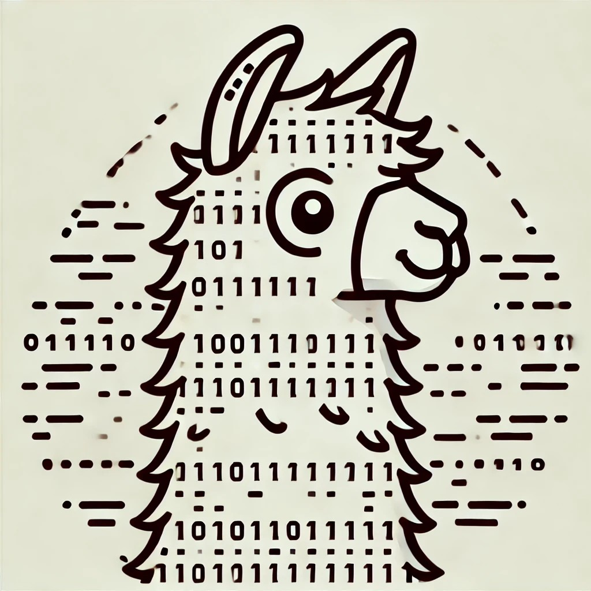

# Awesome-LLM-Watermark

<!--  -->

An UP-TO-DATE collection list for Large Language Model (LLM) Watermark

<!-- vscode-markdown-toc -->

* 1. [LLM watermark](#LLMwatermark)

  * 1.1. [Token-level watermark](#Token-levelwatermark)
  * 1.2. [Sentence-level watermark (sentence embedding-based watermark)](#Sentence-levelwatermarksentenceembedding-basedwatermark)
  * 1.3. [Model-level watermark](#Model-levelwatermark)
  * 1.4. [Watermark for Multi-Modal](#WatermarkMultiModal)
  * 1.5. [Watermark for New Area](#NewWatermark)
  * 1.6. [Watermarking detection](#Watermarkingdetection)
  * 1.7. [COT Watermark](#COTWatermark)
  * 1.8. [Low Entropy Watermark](#lowEntropyWatermark)
* 2. [Attack for watermark](#Attackforwatermark)

  * 2.1. [Watermark stealing attack](#Watermarkstealing)
  * 2.2. [Watermark removal attack](#Watermarkremoval)
  * 2.3. [Watermark spoofing attack & Learnability](#Watermarkspoofing)
  * 2.4. [Robust watermark](#Robustwatermark)
  * 2.5. [Anti-spoofing Watermark](#AntiSpoofwatermark)
* 3. [Multi-bit watermark](#Multi-bitwatermark)
* 4. [Unbiased watermark](#Unbiasedwatermark)
* 5. [Analysis of LLM watermark](#AnalysisofLLMwatermark)
* 6. [Watermark for Diffusion Language Model](#dllmwm)
* 7. [Survey](#Survey)

<!-- vscode-markdown-toc-config
	numbering=true
	autoSave=true
	/vscode-markdown-toc-config -->

<!-- /vscode-markdown-toc -->

## 1. LLM watermark

### 1.1. Token-level watermark

* A Watermark for Large Language Models
  * ICML 2023
  * [http://arxiv.org/abs/2301.10226](http://arxiv.org/abs/2301.10226)
* Publicly Detectable Watermarking for Language Models [paper](http://arxiv.org/abs/2310.18491)
* An Unforgeable Publicly Verifiable Watermark for Large Language Models
  * ICLR 2024
  * https://openreview.net/forum?id=gMLQwKDY3N
* On the Reliability of Watermarks for Large Language Models
  * ICLR 2024
  * https://openreview.net/forum?id=DEJIDCmWOz
* Improving the Generation Quality of Watermarked Large Language Models via Word Importance Scoring [paper](http://arxiv.org/abs/2311.09668)
* WatME: Towards Lossless Watermarking Through Lexical Redundancy
  * ACL 2024
  * https://aclanthology.org/2024.acl-long.496/
  * **Alias** X-Mark: Towards Lossless Watermarking Through Lexical Redundancy [paper](http://arxiv.org/abs/2311.09832)
* Towards Optimal Statistical Watermarking [paper](http://arxiv.org/abs/2312.07930)
* Who Wrote this Code? Watermarking for Code Generation
  * ACL 2024
  * https://aclanthology.org/2024.acl-long.268
* Natural language watermarking via paraphraser-based lexical substitution
  * Artificial Intelligence
  * https://linkinghub.elsevier.com/retrieve/pii/S000437022300005X
* Adaptive Text Watermark for Large Language Models
  * ICML 2024
  * [paper](https://proceedings.mlr.press/v235/liu24e.html#:~:text=This%20paper%20proposes%20an%20adaptive%20text%20watermarking%20strategy,model%20and%20keep%20the%20low-entropy%20token%20distributions%20untouched.)
* Duwak: Dual Watermarks in Large Language Models
  * ACL findings 2024
  * https://aclanthology.org/2024.findings-acl.678
* Permute-and-Flip: An optimally stable and watermarkable decoder for LLMs
  * NeurIPS workshop 2024
  * https://arxiv.org/pdf/2402.05864
* BiMarker: Enhancing Text Watermark Detection for Large Language Models with Bipolar Watermarks
  * http://arxiv.org/abs/2501.12174
* Publicly-Detectable Watermarking for Language Models
  * http://arxiv.org/abs/2310.18491
* PVMark: Enabling Public Verifiability for LLM Watermarking Schemes
  * http://arxiv.org/abs/2510.26274
* A watermark for order-agnostic language models
  * ICLR 2025
* GumbelSoft: Diversified Language Model Watermarking via the GumbelMax-trick
  * http://arxiv.org/abs/2402.12948
* MorphMark: Flexible Adaptive Watermarking for Large Language Models
  * http://arxiv.org/abs/2505.11541

### 1.2. Sentence-level watermark (sentence embedding-based watermark)

* WaterPool: A Watermark Mitigating Trade-offs among Imperceptibility, Efficacy and Robustness
  * http://arxiv.org/abs/2405.13517
* SemStamp: A Semantic Watermark with Paraphrastic Robustness for Text Generation
  * NAACL 2024
  * http://arxiv.org/abs/2310.03991
* k-SemStamp: A Clustering-Based Semantic Watermark for Detection of Machine-Generated Text
  * ACL Findings 2024
  * http://arxiv.org/abs/2402.11399
* A Semantic Invariant Robust Watermark for Large Language Models
  * ICLR 2024
  * http://arxiv.org/abs/2310.06356
* A Robust Semantics-based Watermark for Large Language Model against Paraphrasing
  * NAACL Findings 2024
  * https://aclanthology.org/2024.findings-naacl.40
* Context-aware Watermark with Semantic Balanced Green-red Lists for Large Language Models
  * EMNLP 2024
  * https://aclanthology.org/2024.emnlp-main.1260
* Token-Specific Watermarking with Enhanced Detectability and Semantic Coherence for Large Language Models
  * ICML 2024
  * http://arxiv.org/abs/2402.18059
* SEFD: Semantic-Enhanced Framework for Detecting LLM-Generated Text [paper](http://arxiv.org/abs/2411.12764)
* DeepTextMark: Deep Learning based Text Watermarking for Detection of Large Language Model Generated Text [paper](http://arxiv.org/abs/2305.05773)
* Adversarial Watermarking Transformer: Towards Tracing Text Provenance with Data Hiding
  * IEEE S&P 2021
  * https://ieeexplore.ieee.org/document/9519400/
* PersonaMark: Personalized LLM watermarking for model protection and user attribution [paper](http://arxiv.org/abs/2409.09739)
* REMARK-LLM: A Robust and Efficient Watermarking Framework for Generative Large Language Models
  * USENIX Security 2024
* In-Context Watermarks for Large Language Models
  * http://arxiv.org/abs/2505.16934
* PMark: Towards Robust and Distortion-free Semantic-level Watermarking with Channel Constraints
  * http://arxiv.org/abs/2509.21057
* Watermarking Conditional Text Generation for AI Detection: Unveiling Challenges and a Semantic-Aware Watermark Remedy
  * AAAI
* CoheMark: A Novel Sentence-Level Watermark for Enhanced Text Quality
* 

### 1.3. Model-level watermark

* Provable Robust Watermarking for AI-Generated Text
* ICLR 2024
* http://arxiv.org/abs/2306.17439
* Watermarking LLMs with Weight Quantization [paper](http://arxiv.org/abs/2310.11237)
* EmMark: Robust Watermarks for IP Protection of Embedded Quantized Large Language Models [paper](http://arxiv.org/abs/2402.17938)
* Watermarking Counterfactual Explanations [paper](http://arxiv.org/abs/2405.18671)
* Provably Robust Watermarks for Open-Source Language Models [paper](http://arxiv.org/abs/2410.18861)
* Learning to Watermark LLM-generated Text via Reinforcement Learning [paper](http://arxiv.org/abs/2403.10553)
* Towards Watermarking of Open-Source LLMs [paper](https://arxiv.org/abs/2502.10525)
* GaussMark: A Practical Approach for Structural Watermarking of Language Models
  * http://arxiv.org/abs/2501.13941
* Can Watermarked LLMs be Identified by Users via Crafted Prompts?
  * http://arxiv.org/abs/2410.03168
* An Efficient White-box LLM Watermarking for IP Protection on Online Market Platforms
  * KDD 2025
  * https://dl.acm.org/doi/10.1145/3711896.3736841

### 1.4.Watermark for Multi-Modal

* VLA-Mark: A cross modal watermark for large vision-language alignment model
* A Watermark for Auto-Regressive Speech Generation Models
* From One Stolen Utterance: Assessing the Risks of Voice Cloning in the AIGC Era
  * S&P 2025
  * https://ieeexplore.ieee.org/document/11023497/
* Evaluating Durability: Benchmark Insights into Multimodal Watermarking
  * http://arxiv.org/abs/2406.03728

### 1.5.Watermark for New Area
* KGMark: A Diffusion Watermark for Knowledge Graphs
  * ICME 2025
  * https://arxiv.org/abs/2505.23873
* AgentMark: Utility-Preserving Behavioral Watermarking for Agents
  * http://arxiv.org/abs/2601.03294
* Securing the Language of Life: Inheritable Watermarks from DNA Language Models to Proteins
  * NeurIPS 2025
  * https://openreview.net/pdf?id=lh5sXuGfk8
* FoldMark: Safeguarding Protein Structure Generative Models with Distributional and Evolutionary Watermarking
  * http://biorxiv.org/lookup/doi/10.1101/2024.10.23.619960
* Enhancing privacy in biosecurity with watermarked protein design
  * https://academic.oup.com/bioinformatics/article/doi/10.1093/bioinformatics/btaf141/8124073
* TabularMark: Watermarking Tabular Datasets for Machine Learning
  * http://arxiv.org/abs/2406.14841

### 1.6.Watermarking detection

* An Entropy-based Text Watermarking Detection Method
  * ACL 2024
  * https://aclanthology.org/2024.acl-long.630.pdf
* WaterSeeker: Efficient Detection of Watermarked Segments in Large Documents [paper](http://arxiv.org/abs/2409.05112)
* Optimal Detection for Language Watermarks with Pseudorandom Collision
  * http://arxiv.org/abs/2510.22007
* Adaptive Testing for Segmenting Watermarked Texts From Language Models
  * http://arxiv.org/abs/2511.06645
* On the Empirical Power of Goodness-of-Fit Tests in Watermark Detection
  * http://arxiv.org/abs/2510.03944
* Improving Detection of Watermarked Language Models
  * http://arxiv.org/abs/2508.13131
* Watermarking Cryptographic Capabilities
  * 10.1145/2897518.2897651
* Black-Box Detection of Language Model Watermarks
  * http://arxiv.org/abs/2405.20777

### 1.7.COT Watermark
* Distilling the Thought, Watermarking the Answer: A Principle Semantic Guided Watermark for Large Reasoning Models
  * https://openreview.net/forum?id=T6NVogsXCZ
* CoTGuard: Using Chain-of-Thought Triggering for Copyright Protection in Multi-Agent LLM Systems
  * http://arxiv.org/abs/2505.19405
* CoTSRF: Utilize Chain of Thought as Stealthy and Robust Fingerprint of Large Language Models
  * http://arxiv.org/abs/2505.16785

### 1.8.Low Entropy Watermark

* Practical and Effective Code Watermarking for Large Language Models
* Disappearing Ink: Obfuscation Breaks N-gram Code Watermarks in Theory and Practice
* HeavyWater and SimplexWater: Watermarking Low-Entropy Text Distributions
* Entropy-Guided Watermarking for LLMs: A Test-Time Framework for Robust and Traceable Text Generation
  * http://arxiv.org/abs/2504.12108
* Invisible Entropy: Towards Safe and Efficient Low-Entropy LLM Watermarking
  * http://arxiv.org/abs/2505.14112
* CODEIP: A Grammar-Guided Multi-Bit Watermark for Large Language Models of Code
* Who Wrote this Code? Watermarking for Code Generation

## 2. Attack for watermark

### 2.1. Watermark stealing attack

* Large Language Model Watermark Stealing With Mixed Integer Programming
  * ACSAC 2024
  * http://arxiv.org/abs/2405.19677
* Watermark Stealing in Large Language Models
  * ICLR 2024 Workshop, ICML 2024
  * http://arxiv.org/abs/2402.19361
* Bypassing LLM Watermarks with Color-Aware Substitutions
  * ACL 2024
  * https://aclanthology.org/2024.acl-long.464
* Breaking Distortion-free Watermarks in Large Language Models
  * http://arxiv.org/abs/2502.18608

### 2.2. Watermark removal attack

* Character-Level Perturbations Disrupt LLM Watermarks
  * NDSS 2026
  * http://arxiv.org/abs/2509.09112
* Paraphrasing evades detectors of AI-generated text, but retrieval is an effective defense
  * NeurIPS 2023
  * http://arxiv.org/abs/2303.13408
* Can Watermarks Survive Translation? On the Cross-lingual Consistency of Text Watermark for Large Language Models
  * ACL 2024
  * http://arxiv.org/abs/2402.14007
* Watermark Smoothing Attacks against Language Models
  * http://arxiv.org/abs/2407.14206
* De-mark: Watermark Removal in Large Language Models
  * https://arxiv.org/pdf/2410.13808
* No Free Lunch in LLM Watermarking: Trade-offs in Watermarking Design Choices
  * NeurIPS 2024
  * [paper](https://openreview.net/forum?id=rIOl7KbSkv&referrer=%5Bthe%20profile%20of%20Virginia%20Smith%5D(%2Fprofile%3Fid%3D~Virginia_Smith1))
* Watermarks in the Sand: Impossibility of Strong  Watermarking for Language Models
  * ICML 2024
  * [paper](https://arxiv.org/abs/2311.04378)
  * [offical cite](https://hanlin-zhang.com/impossibility-watermarks/)
* Watermark under Fire: A Robustness Evaluation of LLM  Watermarking
  * EMNLP 2025 findings
  * https://aclanthology.org/2025.findings-emnlp.1148/
  * **Alias** WaterPark: A Robustness Assessment of Language Model Watermarking
* $B^4$: A Black-Box Scrubbing Attack on LLM Watermarks
  * http://arxiv.org/abs/2411.01222
* Can AI-Generated Text be Reliably Detected? [paper](http://arxiv.org/abs/2303.11156)
* Lost in Overlap: Exploring Watermark Collision in LLMs [paper](http://arxiv.org/abs/2403.10020)
* RLCracker: Exposing the Vulnerability of LLM Watermarks with Adaptive RL Attacks
  * http://arxiv.org/abs/2509.20924
* Robustness Assessment and Enhancement of Text Watermarking for Google's SynthID
  * http://arxiv.org/abs/2508.20228
* Sandcastles in the Storm: Revisiting the (Im)possibility of Strong Watermarking
  * ACL 2025
  * https://aclanthology.org/2025.acl-long.1436/
* Attacking LLM Watermarks by Exploiting Their Strengths
  * http://arxiv.org/abs/2402.16187
* Revealing Weaknesses in Text Watermarking Through Self-Information Rewrite Attacks
  * ICML 2025
  * http://arxiv.org/abs/2505.05190
* Warfare:Breaking the Watermark Protection of AI-Generated Content
  * http://arxiv.org/abs/2310.07726
* Optimizing Adaptive Attacks against Content Watermarks for Language Models
  * http://arxiv.org/abs/2410.02440

### 2.3. Watermark spoofing attack & Learnability

* Discovering Clues of Spoofed LM Watermarks
  * http://arxiv.org/abs/2410.02693
* On the Learnability of Watermarks for Language Models
  * ICLR 2024
  * http://arxiv.org/abs/2312.04469
* CAN WATERMARKS BE USED TO DETECT LARGE LANGUAGE MODEL INTELLECTUAL PROPERTY IN- FRINGEMENT FOR FREE?
* STAMP Your Content: Proving Dataset Membership via Watermarked Rephrasings
* Bileve: Securing Text Provenance in Large Language Models Against Spoofing with Bi-level Signature
  * http://arxiv.org/abs/2406.01946

### 2.4. Robust watermark

* Edit Distance Robust Watermarks for Language Models
  * NeurIPS 2024
  * https://openreview.net/pdf?id=FZ45kf5pIA
* Waterfall: Framework for Robust and Scalable Text Watermarking [paper](http://arxiv.org/abs/2407.04411)
* Pseudorandom Error-Correcting Codes
  * http://arxiv.org/abs/2402.09370
  * Advances in Cryptology – CRYPTO 2024
* Can Watermarked LLMs be Identified by Users via Crafted Prompts?
  * https://openreview.net/forum?id=ujpAYpFDEA
* Robust Steganography from Large Language Models
  * http://arxiv.org/abs/2504.08977
* Post-Hoc Watermarking for Robust Detection in Text Generated by Large Language Models
  * COLING 2025
  * https://aclanthology.org/2025.coling-main.364/
* PostMark: A Robust Blackbox Watermark for Large Language Models
  * EMNLP 2024
  * https://aclanthology.org/2024.emnlp-main.506/
* WaterSearch: A Quality-Aware Search-based Watermarking Framework for Large Language Models
  * http://arxiv.org/abs/2512.00837
* DualGuard: Dual-stream Large Language Model Watermarking Defense against Paraphrase and Spoofing Attack
  * http://arxiv.org/abs/2512.16182
* Improved Pseudorandom Codes from Permuted Puzzles
  * http://arxiv.org/abs/2512.08918
* Watermarking Language Models with Error Correcting Codes
  * http://arxiv.org/abs/2406.10281
* Two Halves Make a Whole: How to Reconcile Soundness and Robustness in Watermarking for Large Language Models
  * https://eprint.iacr.org/2024/2062
* Robust and Efficient Watermarking of Large Language Models Using Error Correction Codes
  * Proceedings on Privacy Enhancing Technologies
* Entropy-Guided Watermarking for LLMs: A Test-Time Framework for Robust and Traceable Text Generation
* A Certified Robust Watermark For Large Language Models
* WaterMax: breaking the LLM watermark detectability-robustness-quality trade-off
* Is Multilingual LLM Watermarking Truly Multilingual? Scaling Robustness to 100+ Languages via Back-Translation
  * http://arxiv.org/abs/2510.18019
  * [code](https://github.com/asimzz/steam)

### 2.5.  Anti-spoofing Watermark
* Detecting Post-generation Edits to Watermarked LLM Outputs via Combinatorial Watermarking
  * http://arxiv.org/abs/2510.01637
* Discovering Spoofing Attempts on Language Model Watermarks
  * http://arxiv.org/abs/2410.02693
* DAMAGE: Detecting Adversarially Modified AI Generated Text
  * http://arxiv.org/abs/2501.03437
* Let Watermarks Speak: A Robust and Unforgeable Watermark for Language Models
  * http://arxiv.org/abs/2412.19603
* An Unforgeable Publicly Verifiable Watermark for Large Language Models
  * http://arxiv.org/abs/2307.16230
* DualGuard: Dual-stream Large Language Model Watermarking Defense against Paraphrase and Spoofing Attack
  * http://arxiv.org/abs/2512.16182
* Two Halves Make a Whole: How to Reconcile Soundness and Robustness in Watermarking for Large Language Models
  * https://eprint.iacr.org/2024/2062
* Mitigating Watermark Forgery in Generative Models via Multi-Key Watermarking
  * http://arxiv.org/abs/2507.07871
* Provably Robust and Secure Steganography in Asymmetric Resource Scenario
  * SP 2025
* Defending LLM Watermarking Against Spoofing Attacks with Contrastive Representation Learning

## 3. Multi-bit watermark

* Three Bricks to Consolidate Watermarks for Large Language Models [paper](http://arxiv.org/abs/2308.00113)
* Provably Robust Multi-bit Watermarking for AI-generated Text via Error Correction Code [paper](http://arxiv.org/abs/2401.16820)
  * USENIX Security 2025
* Advancing Beyond Identification: Multi-bit Watermark for Large Language Models
  * NAACL 2024
  * https://aclanthology.org/2024.naacl-long.224
* Towards Codable Watermarking for Injecting Multi-bits Information to LLMs [paper](http://arxiv.org/abs/2307.15992)
* Robust Multi-bit Natural Language Watermarking through Invariant Features
  * ACL 2023
  * https://aclanthology.org/2023.acl-long.117
* Multi-Bit Distortion-Free Watermarking for Large Language Models [paper](http://arxiv.org/abs/2402.16578)
* Towards Codable Watermarking for Injecting Multi-bits Information to LLMs
  * ICLR 2024
  * https://openreview.net/forum?id=JYu5Flqm9D
* Robust Multi-bit Text Watermark with LLM-based Paraphrasers [paper](http://arxiv.org/abs/2412.03123)
* PersonaMark: Personalized LLM watermarking for model protection and user attribution [paper](http://arxiv.org/abs/2409.09739)
* CODEIP: A Grammar-Guided Multi-Bit Watermark for Large Language Models of Code
  * EMNLP findings 2024
  * https://aclanthology.org/2024.findings-emnlp.541
* Enhancing Watermarked Language Models to Identify Users [paper](http://arxiv.org/abs/2405.11109)
* CredID: Credible Multi-Bit Watermark for Large Language Models Identification [paper](http://arxiv.org/abs/2412.03107)
* Watermarking Language Models for Many Adaptive Users
  * SP 2025
* SAEMark: Multi-bit LLM Watermarking with Inference-Time Scaling
  * http://arxiv.org/abs/2508.08211
* Majority Bit-Aware Watermarking For Large Language Models
  * http://arxiv.org/abs/2508.03829
* BiMark: Unbiased Multilayer Watermarking for Large Language Models
  * ICML 2025
* StealthInk: A Multi-bit and Stealthy Watermark for Large Language Models
  * ICML 2025
  * http://arxiv.org/abs/2506.05502
* TrojanStego: Your Language Model Can Secretly Be A Steganographic Privacy Leaking Agent
  * http://arxiv.org/abs/2505.20118
* DERMARK: A Dynamic, Efficient and Robust Multi-bit Watermark for Large Language Models
  * http://arxiv.org/abs/2502.05213
* Distributional Information Embedding: A Framework for Multi-bit Watermarking
  * http://arxiv.org/abs/2501.16558

## 4. Unbiased watermark

* Unbiased Watermark for Large Language Models
  * ICLR 2023
  * http://arxiv.org/abs/2310.10669
* Undetectable Watermarks for Language Models
  * COLT 2024
  * https://proceedings.mlr.press/v247/christ24a
* Robust Distortion-free Watermarks for Language Models
  * TMLR 2024
  * https://openreview.net/forum?id=FpaCL1MO2C
* A Watermark for Low-entropy and Unbiased Generation in Large Language Models
  * https://openreview.net/forum?id=hTUrBJqECJ
* A Resilient and Accessible Distribution-Preserving Watermark for Large Language Models
  * ICML 2024
  * https://arxiv.org/abs/2310.07710
* Watermarking Language Models with Error Correcting Codes [paper](http://arxiv.org/abs/2406.10281)
* Scalable watermarking for identifying large language model outputs
  * Nature 2024
  * https://www.nature.com/articles/s41586-024-08025-4
* Multi-Bit Distortion-Free Watermarking for Large Language Models [paper](http://arxiv.org/abs/2402.16578)
* Distortion-free Watermarks are not Truly Distortion-free under Watermark Key Collisions [paper](http://arxiv.org/abs/2406.02603)
  * **Alias** Pseudo- vs. True-Randomness: Rethinking Distortion-Free Watermarks of Language Models under Watermark Key Collisions [paper](https://openreview.net/forum?id=jln7IcheW6)
* HeavyWater and SimplexWater: Distortion-free LLM Watermarks for Low-Entropy Distributions
* An Ensemble Framework for Unbiased Language Model Watermarking
* Analyzing and Evaluating Unbiased Language Model Watermark
* Watermarking Large Language Models: An Unbiased and Low-risk Method
  * ACL 2025
* BiMark: Unbiased Multilayer Watermarking for Large Language Models
* LLM Watermarking Using Mixtures and Statistical-to-Computational Gaps
* From Trade-off to Synergy: A Versatile Symbiotic Watermarking Framework for Large Language Models
* Optimized Couplings for Watermarking Large Language Models
* Improved Unbiased Watermark for Large Language Models
* Debiasing Watermarks for Large Language Models via Maximal Coupling

## 5. Analysis of LLM watermark

* Can Watermarking Large Language Models Prevent  Copyrighted Text Generation and Hide Training Data?
  * ICML workshop
  * https://openreview.net/pdf?id=79NfpNZkXW
* On Evaluating The Performance of Watermarked Machine-Generated Texts Under Adversarial Attacks
  * http://arxiv.org/abs/2407.04794
* Optimizing Adaptive Attacks against Content Watermarks for Language Models
  * http://arxiv.org/abs/2410.02440
* Optimizing Watermarks for Large Language Models
  * ICML 2024
  * https://proceedings.mlr.press/v235/wouters24a.html
* Performance Trade-offs of Watermarking Large Language Models [paper](http://arxiv.org/abs/2311.09816)
* Watermarking Makes Language Models Radioactive [paper](http://arxiv.org/abs/2402.14904)
* WaterJudge: Quality-Detection Trade-off when Watermarking Large Language Models [paper](http://arxiv.org/abs/2403.19548)
* Towards Better Statistical Understanding of Watermarking LLMs [paper](http://arxiv.org/abs/2403.13027)
* Inevitable Trade-off between Watermark Strength and Speculative Sampling Efficiency for Language Models [paper](http://arxiv.org/abs/2410.20418)
* LLM Watermarking Using Mixtures and Statistical-to-Computational Gaps
  * http://arxiv.org/abs/2505.01484
* Lost in Overlap: Exploring Logit-based Watermark Collision in LLMs
  * http://arxiv.org/abs/2403.10020

## 6. Watermark for Diffusion Language Model

* STEAD: Robust Provably Secure Linguistic Steganography with Diffusion Language Model
* LR-DWM: Efficient Watermarking for Diffusion Language Models
* Watermarking Discrete Diffusion Language Models
* A watermark for order-agnostic language models
  * ICLR 2025
* Every Step Counts: Decoding Trajectories as Authorship Fingerprints of dLLMs
* DMark: Order-Agnostic Watermarking for Diffusion Large Language Models
* Watermarking Diffusion Language Models
  * ICLR 2026

## 7. Survey

* A Survey of Text Watermarking in the Era of Large Language Models
  * ACM Computing Surveys 2024
  * http://arxiv.org/abs/2312.07913
* Mark My Words: Analyzing and Evaluating Language Model Watermarks [paper](http://arxiv.org/abs/2312.00273)
* WaterBench: Towards Holistic Evaluation of Watermarks for Large Language Models
  * ACL 2024
  * https://aclanthology.org/2024.acl-long.83/
* SoK: On the Role and Future of AIGC Watermarking in the Era of Gen-AI [paper](http://arxiv.org/abs/2411.11478)
* SoK: Watermarking for AI-Generated Content [paper](https://arxiv.org/pdf/2411.18479)
